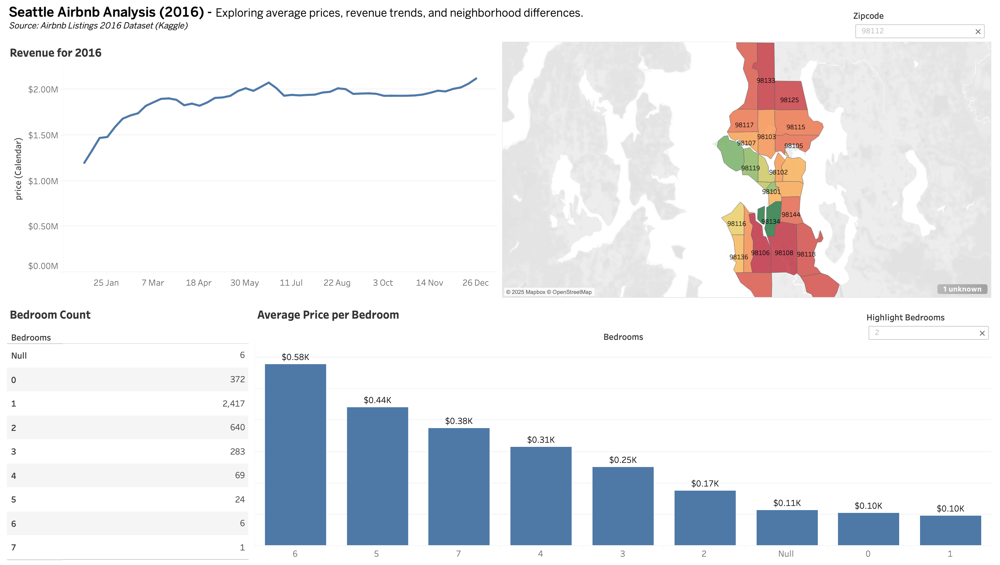

# 🏙️ Seattle Airbnb Analysis – 2016

This is a Tableau dashboard I created to explore Airbnb listings in Seattle in 2016. My goal was to understand **how prices and revenues vary across neighborhoods** and **by the number of bedrooms**, and to create a dashboard that’s clear and interactive for anyone exploring the data.

---

## 📊 About the Dashboard

**Title:** Seattle Airbnb Analysis – 2016  
**Tool:** Tableau Desktop / Tableau Public  
**Data Source:** See `/data/README.md`  
**Author:** Nadia Rozman

The dashboard includes:
- **Average Price per Bedroom** – to see how nightly rates change with room size  
- **Revenue Over Time** – tracking trends throughout 2016  
- **Price by ZIP Code** – geographic variation across Seattle neighborhoods  
- **Bedroom Count Distribution** – showing which property types are most common

---

## 🔍 What I Learned

- Larger listings (5–6 bedrooms) generally have the highest nightly rates  
- Revenue increased steadily in the first half of 2016, then stabilized  
- Some ZIP codes consistently show higher average prices, highlighting popular neighborhoods  
- The majority of listings are 1-bedroom properties

---

## 🗺️ Dashboard Preview

### Interactive Version:
[🔗 View Interactive Dashboard on Tableau Public](https://public.tableau.com/app/profile/nadia.rozman/viz/Seattle_Airbnb_Analysis_2016_17617223428960/Dashboard1)  

### Static Preview:

---

## 💾 Files Included

- `README.md` – Project overview (this file)  
- `Seattle_Airbnb_Analysis_2016.twbx` – Tableau workbook  
- `seattle_airbnb_dashboard.png` – Dashboard screenshot  
- `data/README.md` – Dataset instructions
  
---

## ⚙️ How to Explore

1. Open the `.twbx` file in Tableau Desktop or Tableau Public  
2. Download the dataset from Kaggle and place it in `/data` as described in `data/README.md`  
3. Interact with filters, tooltips, and charts to explore the data yourself

---

## 📚 Dataset

For licensing reasons, the dataset isn’t included in this repository. See [`/data/README.md`](data/README.md) for instructions on downloading it from Kaggle.

---

## 🧠 Skills & Takeaways

Through this project, I practiced:
- Cleaning and structuring data for Tableau  
- Building interactive dashboards with multiple charts  
- Using calculated fields and geographic mapping  
- Communicating insights effectively through visual storytelling

---

### ✨ Created by Nadia Rozman | October 2025
